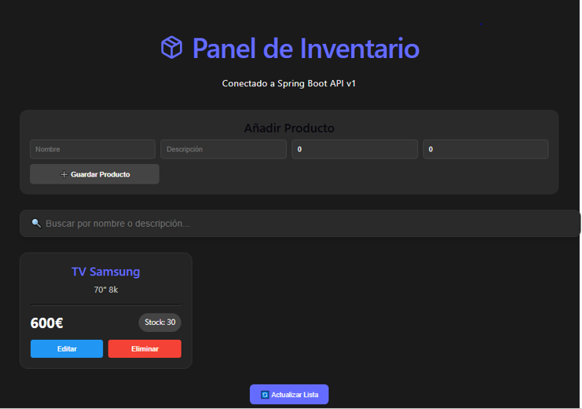

# 📦 SaaS Inventory - Sistema de Gestión de Inventario / Inventory Management System

  
  
  
  
  
  
  
  
  

  <h3>[ <a href="#español">Español</a> ] | [ <a href="#english">English</a> ]</h3>

---

# English Version

Hello! This is my SaaS Inventory project. It is a system to manage products and stock that I built to learn how to connect a modern frontend with a real backend server and a relational PostgreSQL database in production.

🔗 Live Demo (Frontend): https://saas-inventory-1.onrender.com

🔗 API URL (Backend): https://saas-inventory-h49i.onrender.com

🔗 Interactive Documentation (Swagger): https://saas-inventory-h49i.onrender.com/swagger-ui/index.html

##  Live Demo & Links
* **Frontend Web App (Render):** [https://saas-inventory-1.onrender.com](https://saas-inventory-1.onrender.com/)
* **Backend API (Render):** [https://saas-inventory-h49i.onrender.com](https://saas-inventory-h49i.onrender.com)
* **API Documentation (Swagger UI):** [https://saas-inventory-h49i.onrender.com/swagger-ui/index.html](https://saas-inventory-h49i.onrender.com/swagger-ui/index.html)

## 📸 Dashboard Preview
Here is a look at the inventory in action, showing the company inventory dashboard, search filtering, and CRUD operations:

  

##  Issues I Encountered & How I Solved Them (My Learning Journey)
Deploying an application to production (Render) has its challenges. These were the most important issues I had to solve to get the app running properly:

1. The "/api/v1" Route Error (404 Error)
What happened: Initially, the frontend was trying to fetch products from /productos but the backend had them mapped under /api/v1/productos. The server couldn't find the route and returned a 404 error.

How I fixed it: I updated the ProductService.js file in React to unify all endpoints under the correct API prefix.

2. The Brackets "Monster URL" (ERR_NAME_NOT_RESOLVED)
What happened: When setting up the server URL in the environment variables, I accidentally included brackets: [https://saas-inventory-h49i.onrender.com]. This caused React to try to call an invalid address that the browser could not understand.

How I fixed it: I cleaned up the environment variable in the Render dashboard, leaving it clean (without brackets), and added a small text "sanitizer" in my axiosInstance.js file to ensure the URL is always processed without strange characters.

3. The CORS Block (CORS Policy Error)
What happened: For security reasons, the Spring Boot backend blocked requests coming from the React frontend URL because it didn't recognize it as a safe origin.

How I fixed it: I added a CORS configuration class in Java (WebConfig.java) to explicitly tell Spring Boot to safely allow cross-origin requests from my React app on Render.

4. Infinite JSON Recursion Loop (StackOverflowError)
What happened: When setting up the bidirectional One-to-Many relationship between Company and Product, the JSON serializer kept trying to serialize the product within the company, and the company within the product forever.

How I fixed it: I cleanly structured the relationship using Jackson annotations: @JsonManagedReference in the Empresa entity and @JsonBackReference in the Producto entity.

##  AI Assistance & Collaboration 

This project was developed using modern **AI-assisted development** workflows. Generative AI (Gemini) was utilized as a pair-programmer to assist in:
* Architectural decision-making (JPA bidirectional relationships & Jackson references).
* Debugging system errors (such as CORS configurations and React rendering cycles).
* Writing and optimization of clean, modular code for both Spring Boot and React.

##  Tech Stack
Java 17 & Spring Boot 3 (for the backend server).

Gradle (for managing Java dependencies).

Spring Data JPA & Hibernate (for the ORM).

PostgreSQL (for the database).

React with Vite (for the fast web interface).

Axios (for making network calls between React and Java).

Lucide React & React Hot Toast (for UI icons and notifications).

##  Key Features
* **Multi-tenant Concept:** Products are bidirectionally mapped to specific companies without infinite JSON serialization loops.
* **Full CRUD Operations:** Seamless creation, reading, updating, and deletion of products and companies.
* **Live Search Filter:** Instant client-side search filtering by name or description.
* **Interactive API Playground:** Fully documented endpoints via Swagger.
* **Secure CORS Configuration:** Standardized origins supporting local and cloud environments.

##  How to Run the Project Locally
1. Start the Backend (Java)
  1. Go to the backend folder.

  2. Open the src/main/resources/application.yaml file and fill in your local PostgreSQL database details:

  spring:
    datasource:
      url: jdbc:postgresql://localhost:5432/tu_base_datos
      username: tu_usuario
      password: tu_contraseña
  jpa:
    hibernate:
      ddl-auto: update
    show-sql: true

  3. Run the server from your terminal or IDE (like IntelliJ or VS Code):

   ./gradlew bootRun

2. Start the Frontend (React)
   1. Go to the frontend folder in another terminal window.

   2. Install the required libraries:

      npm install

   3. Create a file named .env in the root of the frontend folder and set your local server URL:

   #  Make sure not to use brackets [] or trailing slashes /
     VITE_API_URL=http://localhost:8080

   4. Start the React development server:
      npm run dev

 Key Configuration for Production (On Render)
To make the deployed project work on Render, the Frontend environment variable must be configured in the dashboard as follows:

Key: VITE_API_URL

Value: https://saas-inventory-h49i.onrender.com (No brackets, no parentheses!)

⚠️ Important Note: Every time you change this variable on Render, remember to trigger a Manual Deploy -> Clear Cache and Deploy on the Frontend service so React compiles with the new URL.
---

# Versión en Español
¡Hola! Este es mi proyecto **SaaS Inventory**. Es un sistema para gestionar productos y stock que desarrollé para aprender a conectar un frontend moderno con un servidor backend real y una base de datos relacional PostgreSQL en producción

##  Enlaces del Proyecto y Demo en Vivo

* **🔗 Demo en Vivo (Frontend):** [https://saas-inventory-1.onrender.com](https://saas-inventory-1.onrender.com)
* **🔗 API URL (Backend):** [https://saas-inventory-h49i.onrender.com](https://saas-inventory-h49i.onrender.com)
* **🔗 Documentación Interactiva (Swagger):** [https://saas-inventory-h49i.onrender.com/swagger-ui/index.html](https://saas-inventory-h49i.onrender.com/swagger-ui/index.html)

##  Vista Previa de la Interfaz
Aquí puedes ver cómo luce el panel de administración de inventarios:

  

---

##  Errores que encontré y cómo los solucioné (Mi aprendizaje)

Desplegar una aplicación en producción (**Render**) tiene sus retos. Estos fueron los problemas más importantes que tuve que resolver para que la app funcionara de manera óptima:

### 1. El error de las rutas "/api/v1" (Error 404)
* **Qué pasaba:** Al principio, el frontend intentaba buscar los productos en `/productos` pero el backend los tenía guardados y estructurados bajo `/api/v1/productos`. El servidor no encontraba la ruta y devolvía un error 404.
* **Cómo lo solucioné:** Corregí el archivo `ProductService.js` en React para unificar todas las peticiones bajo el prefijo correcto de la API.

### 2. La "URL Monstruo" con corchetes (ERR_NAME_NOT_RESOLVED)
* **Qué pasaba:** Al configurar la URL del servidor en las variables de entorno, puse corchetes por error: `[https://saas-inventory-h49i.onrender.com]`. Esto hacía que React intentara llamar a una dirección rota que el navegador no entendía.
* **Cómo lo solucioné:** Limpié la variable de entorno en el panel de Render dejándola limpia (sin corchetes) y añadí un pequeño "limpiador" de texto en mi archivo `axiosInstance.js` para asegurar que la URL siempre se procese sin caracteres extraños.

### 3. El bloqueo por CORS (CORS Policy Error)
* **Qué pasaba:** Por seguridad, el backend en Spring Boot bloqueaba las peticiones que venían desde la URL de producción de React porque no la tenía registrada como un origen seguro.
* **Cómo lo solucioné:** Implementé una clase de configuración de CORS en Java (`WebConfig.java`) para decirle explícitamente a Spring Boot que permitiera las peticiones cruzadas de mi web de React en Render.

### 4. Bucle recursivo infinito en JSON (StackOverflowError)
* **Qué pasaba:** Al establecer la relación bidireccional Uno a Muchos (One-to-Many) entre Empresa y Producto, el serializador de JSON intentaba mapear infinitamente el producto dentro de la empresa, y la empresa dentro del producto.
* **Cómo lo solucioné:** Estructuré la relación de manera limpia utilizando las anotaciones de Jackson `@JsonManagedReference` en la entidad `Empresa` y `@JsonBackReference` en `Producto`.

---
 ##  Collaboration asistida con IA

Este proyecto fue desarrollado utilizando flujos de trabajo modernos de **desarrollo asistido por IA**. Se utilizó IA generativa (Gemini) como copiloto de programación (*pair-programming*) para apoyar en:
* Toma de decisiones de arquitectura (relaciones bidireccionales de JPA y referencias de Jackson).
* Resolución de errores (*debugging*) del sistema (como configuraciones de CORS y ciclos de renderizado de React).
* Escritura y optimización de código limpio y modular tanto en Spring Boot como en React.

---

##  Tecnologías que usé

* **Java 17** y **Spring Boot 3** (para el backend).
* **Gradle** (para el manejo de dependencias).
* **Spring Data JPA** & **Hibernate** (para el ORM).
* **PostgreSQL** (para la base de datos).
* **React** con **Vite** (para el frontend rápido).
* **Axios** (para hacer las peticiones HTTP entre React y Java).
* **Lucide React** & **React Hot Toast** (para iconos y notificaciones de UI).

---

## ⚙️ Cómo ejecutar el proyecto en tu computadora (Local)

1. Arrancar el Backend (Java)
  1. Entra a la carpeta del backend.
  2. Abre el archivo `src/main/resources/application.yaml` y pon los datos   de  tu base de datos PostgreSQL local:
 
   spring:
    datasource:
      url: jdbc:postgresql://localhost:5432/tu_base_datos
      username: tu_usuario
      password: tu_contraseña
  jpa:
    hibernate:
      ddl-auto: update
    show-sql: true

  3. Ejecuta el servidor desde tu terminal o tu IDE (como IntelliJ o VS Code):

  ./gradlew bootRun

2. Arrancar el Frontend (React)
   1. Entra a la carpeta del frontend en otra terminal.

   2. Instala las librerías necesarias:

   npm install

   3. Crea un archivo llamado .env en la raíz de la carpeta frontend y pon la URL de tu servidor local:

    # Asegúrate de no poner corchetes [] ni barras finales /
    
    VITE_API_URL=http://localhost:8080

   4. Enciende el servidor de desarrollo de React:

     npm run dev

##  Configuración clave para producción (En Render)
Para que el proyecto funcione desplegado en Render, la variable de entorno del Frontend debe configurarse así en el panel de control:

Key / Nombre: VITE_API_URL

Value / Valor: https://saas-inventory-h49i.onrender.com (¡Sin corchetes ni paréntesis!)

⚠️ Nota importante: Cada vez que cambies esta variable en Render, recuerda hacer un Manual Deploy -> Clear Cache and Deploy en el servicio del Frontend para que React se compile con la URL nueva.

